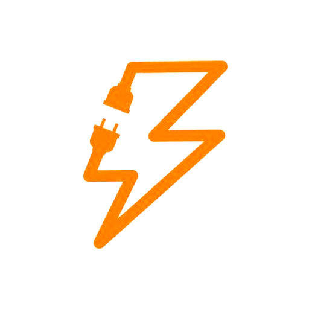
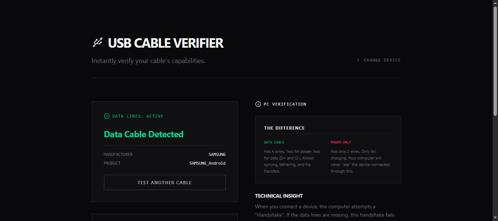

<div align="center">



# 🔌 USB Cable Verifier

### 🚀 Check if your USB cable supports **data transfer** or is **power-only**

<p>
  <a href="https://thinakaranmanokaran.github.io/usb-cable-verifier">
    
  </a>
  <a href="./LICENSE">
    
  </a>
</p>

</div>

---

## 📸 Preview

<p align="center">
  
</p>

---

## ⚡ About The Project

**USB Cable Verifier** is a modern web-based tool that helps you instantly determine whether your USB cable supports:

* ✅ Data Transfer (File Sharing, Tethering)
* ❌ Power-Only Charging

Built using the **WebUSB API**, this tool runs directly in your browser — no installation required.

---

## 🧠 How It Works

### 📱 Mobile

* Detects **charging status**
* Identifies cable health
* Suggests data capability checks

### 💻 PC / Laptop

* Uses **WebUSB handshake**
* Detects connected USB device
* Confirms **data line availability**

### 🔬 Advanced Tests

* 🌐 Network Speed Test (USB Tethering)
* 📁 File Transfer Simulation

---

## 🚀 Features

* ⚡ Instant cable verification
* 🔌 Detect power-only vs data cables
* 🌐 WebUSB-based detection
* 📊 Real-time speed testing
* 📁 File transfer readiness check
* 🎯 Clean and modern UI (Tailwind + Motion)

---

## 🛠️ Tech Stack

* ⚛️ React (Vite)
* 🎨 Tailwind CSS
* 🎞️ Motion (Animations)
* 🔌 WebUSB API
* 🌐 Fetch API (Speed Testing)

---

## 📦 Installation

```bash
git clone https://github.com/thinakaranmanokaran/usb-cable-verifier.git
cd usb-cable-verifier
npm install
npm run dev
```

---

## 🌍 Live Website

👉 https://thinakaranmanokaran.github.io/usb-cable-verifier

---

## ⚠️ Requirements

* Chrome / Edge browser (WebUSB support required)
* USB device + cable for testing

---

## 📌 Use Cases

* Check if your cable supports file transfer
* Debug USB tethering issues
* Identify faulty or low-quality cables
* Verify USB accessories

---

## 👨‍💻 Author

**Thinakaran Manokaran**
🌐 https://thinakaran.dev

---

## 📄 License

This project is licensed under the MIT License.
See the full license here: [LICENSE](./LICENSE)

---

## ⭐ Support

If you found this project useful:

* ⭐ Star the repository
* 🔗 Share with others
* 💡 Contribute improvements

---

<div align="center">

Made with ❤️ by Thinakaran

</div>
